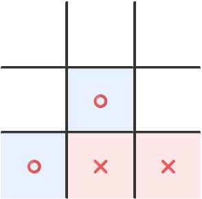

## Can You Beat the AI?

I recently built an [interactive TicTacToe game](../../projects/AI_plays_TicTacToe_interactive.ipynb) where you play against an AI that never loses. The AI uses the classic **minimax algorithm** combined with a clever **magic square representation** to play optimally.

**🎮 Play online (no setup required):** [](https://mybinder.org/v2/gh/MahbubAlam231/AI_plays_TicTacToe/main?filepath=AI_plays_TicTacToe_interactive.ipynb)
**Run all cells, then find the game at the bottom.**

Click to make your moves as ⭕, while the AI responds as ❌.

## The Magic Square Trick

Instead of checking all possible winning patterns explicitly, I used a 3×3 magic square:

<table style="border-collapse: collapse; margin: 20px auto; font-size: 18px; text-align: center;">
  <tr>
    <td style="border: 2px solid #333; width: 30px; height: 30px; background-color: #f0f0f0; color: black;"><b>8</b></td>
    <td style="border: 2px solid #333; width: 30px; height: 30px; background-color: #f0f0f0; color: black;"><b>3</b></td>
    <td style="border: 2px solid #333; width: 30px; height: 30px; background-color: #f0f0f0; color: black;"><b>4</b></td>
  </tr>
  <tr>
    <td style="border: 2px solid #333; width: 30px; height: 30px; background-color: #f0f0f0; color: black;"><b>1</b></td>
    <td style="border: 2px solid #333; width: 30px; height: 30px; background-color: #f0f0f0; color: black;"><b>5</b></td>
    <td style="border: 2px solid #333; width: 30px; height: 30px; background-color: #f0f0f0; color: black;"><b>9</b></td>
  </tr>
  <tr>
    <td style="border: 2px solid #333; width: 30px; height: 30px; background-color: #f0f0f0; color: black;"><b>6</b></td>
    <td style="border: 2px solid #333; width: 30px; height: 30px; background-color: #f0f0f0; color: black;"><b>7</b></td>
    <td style="border: 2px solid #333; width: 30px; height: 30px; background-color: #f0f0f0; color: black;"><b>2</b></td>
  </tr>
</table>

In a magic square, every row, column, and diagonal sums to 15.
(And any three numbers between 1 and 9 that add up to 15 are in a row or column or diagonal.)
This means any TicTacToe winning line also sums to 15! This simple observation allows for efficient win detection using basic arithmetic rather than pattern matching.

For example, in this board position it is the AI's move (❌):

{width="150px"}

It observes that (two of) the ⭕ positions add up to 11 which a 4 less than 15, and the square where 4 is in the magic square is available.
So it plays that position and blocks ⭕'s winning line.

## The Minimax Algorithm

The heart of the AI is the minimax algorithm, which:

- Explores all possible future game states recursively
- Assumes both players play optimally
- Gives a score to all possible board positions: +1 if ❌ has a winning strategy and -1 if ⭕ has a winning strategy
- Gives score 0 when neither player can force a win
- Returns a tuple: a move that achieves best score for player and the score

Here's the core logic:

```python
def minimax(board, player, opp):
    # If no moves left, it's a draw (since AI played perfectly)
    avail_moves_ = avail_moves(board)
    if not avail_moves_:
        return None, 0

    # Check if current player can win
    res = check_player_win(board, player)
    if res is not None:
        return res

    # Try all possible moves
    scores = []
    for i in avail_moves_:
        new_board = board.copy()
        new_board[i] = player
        _, score_ = minimax(new_board, opp, player)
        scores.append((i, score_))

    # Pick best move for current player
    scores.sort(key=lambda x: x[1])
    return scores[-1] if player == "X" else scores[0]
```

## Interactive Gameplay

You can play the game in Jupyter notebook ([](https://mybinder.org/v2/gh/MahbubAlam231/AI_plays_TicTacToe/main?filepath=AI_plays_TicTacToe_interactive.ipynb)) with an interactive widget-based interface.
Run all cells, then find the game at the bottom.
Click to make your move as ⭕, while the AI responds as ❌.

The AI is truly optimal - the best you can do is force a draw. Give it a try and see if you can achieve that!

## Key Features

- **Optimal play**: The AI never makes mistakes
- **Fast computation**: Magic square logic speeds up win detection
- **Interactive UI**: Click-based gameplay using ipywidgets
- **Educational**: Clear implementation of classic AI concepts

The complete code is available on my [GitHub](https://github.com/MahbubAlam231/AI_plays_TicTacToe) with detailed comments explaining each component.

## What I Learned

This project reinforced several important concepts:

1. How simple mathematical tricks (magic squares) can optimize algorithms
2. The elegance of recursive game tree exploration
3. The importance of assuming optimal play in competitive AI
4. Building interactive experiences in Jupyter notebooks

Next, I'm planning to extend this approach to more complex games like Connect Four or even Chess endgames!
